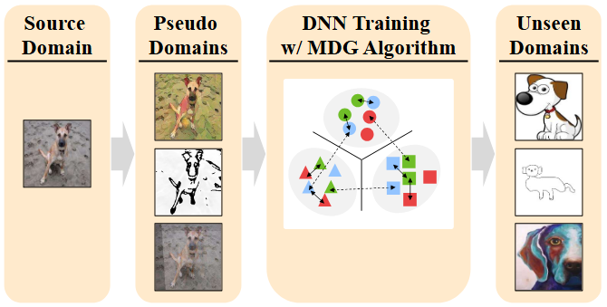

# Pseudo Multi-source Domain Generalization: Bridging the Gap between Single and Multi-source Domain Generalization
This is a pytorch implementation of the following paper [[arXiv]](https://arxiv.org/abs/2505.23173):  


This codebase is mainly based on [[DomainBed]](https://github.com/facebookresearch/DomainBed), with following modifications:
Introduces a flexible framework for generating synthetic multi-domain datasets from a single source domain through style transformations and data augmentation techniques.

Please read license.txt before reading or using the files.  

# Setup Instructions

## Style Transfer Setup
Implementation based on [Bethgelab's stylize-datasets](https://github.com/bethgelab/stylize-datasets).

### Required Files:
1. **Style Images**
   - Download `train.zip` from [Kaggle's painter-by-numbers dataset](https://www.kaggle.com/c/painter-by-numbers/data?select=train.zip)
   - Extract and place in: `PseudoDomainBed/domainbed/lib_augmentations/stylized/`

2. **Model Files**
   - Download from [pytorch-AdaIN releases](https://github.com/naoto0804/pytorch-AdaIN/releases/tag/v0.0.0):
     - `decoder.pth`
     - `vgg_normalised.pth`
   - Place both files in: `PseudoDomainBed/domainbed/lib_augmentations/stylized/models/`

## CartoonGAN Setup
Implementation based on [CartoonGAN-Test-Pytorch-Torch](https://github.com/Yijunmaverick/CartoonGAN-Test-Pytorch-Torch).

### Required Files:
- Download `Hayao_net_G_float.pth` from [here](http://vllab1.ucmerced.edu/~yli62/CartoonGAN/pytorch_pth/Hayao_net_G_float.pth)
- Place in: `PseudoDomainBed/domainbed/lib_augmentations/cartoongan/`

## IPMix Setup
Implementation based on [IPMix GitHub Repository](https://github.com/hzlsaber/IPMix).

### Required Files:
- Download `ifs` folder from [Google Drive - Mixing-set](https://drive.google.com/drive/folders/1OmCpcqEK5hEGopvwlChlnNmu50HM4yVZ)
- Place in: `PseudoDomainBed/domainbed/lib_augmentations/ipmix/`

## Directory Structure

After setup, your directory structure should look like this:

```
PseudoDomainBed/
└── domainbed/
    └── lib_augmentations/
        ├── stylized/
        │   ├── train/
        │   │   └── [style images]
        │   └── models/
        │       ├── decoder.pth
        │       └── vgg_normalised.pth
        ├── cartoongan/
        │   └── Hayao_net_G_float.pth
        └── ipmix/
            └── ifs/
                └── ifs1/
                     └──[images]
                └── ifs2/
                     └──[images]
                └── ifs3/
                     └──[images]
```


# Running Experiments

## Basic Usage

The basic command structure is:
```bash
bash run.sh <model> <dataset> <n_trials_from> <n_trials> <algorithm>
```

Where:
- `<model>`: Neural network architecture
- `<dataset>`: Dataset
- `<n_trials_from>`: Seed value
- `<n_trials>`: Number of trials to run
- `<algorithm>`: MDG (Multi-source Domain Generalization) algorithm to use

### Example

To run an experiment with:
- Model: ResNet50 with BatchNorm
- Dataset: PACS
- Number of trials: 3 (with different seeds)
- MDG Algorithm: ERM (Empirical Risk Minimization)

Use the following command:
```bash
bash run.sh resnet50-BN PACS 10 3 ERM
```

This will:
1. Execute the model training using the ERM algorithm
2. Run three separate trials with different random seeds
3. Use pre-defined pseudo-domains (configured in `sweep.py`)
4. Output results for each trial

## Collecting Results
To aggregate the experimental results, use the following command:
```bash
python -m domainbed.scripts.collect_results --input_dir=./sweep/resnet50-BN --latex
```

Parameters:
- `--input_dir`: Directory containing the experimental results
- `--latex`: Generate output in LaTeX format for paper writing


# Visualizing Pseudo-domains

To visualize how different image transformation techniques modify the original images, use the visualization script:

```bash
python visualize_augs.py [options]
```

Where:
- `--image_dir`: Directory containing test images 
- `--dataset`: Dataset name for hyperparameter selection 
- `--output_dir`: Directory to save visualization results
- `--batch_size`: Batch size for processing

#### Example Usage:
```bash
python visualize_augs.py --image_dir "./my_images" --output_dir "./my_visualizations" --batch_size 12
```

# Citation

```
@misc{enomoto2025pseudomultisourcedomaingeneralization,
      title={Pseudo Multi-Source Domain Generalization: Bridging the Gap Between Single and Multi-Source Domain Generalization}, 
      author={Shohei Enomoto},
      year={2025},
      eprint={2505.23173},
      archivePrefix={arXiv},
      primaryClass={cs.LG},
      url={https://arxiv.org/abs/2505.23173}, 
}
```
